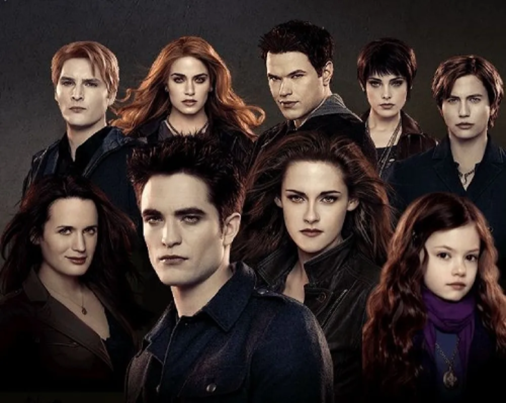
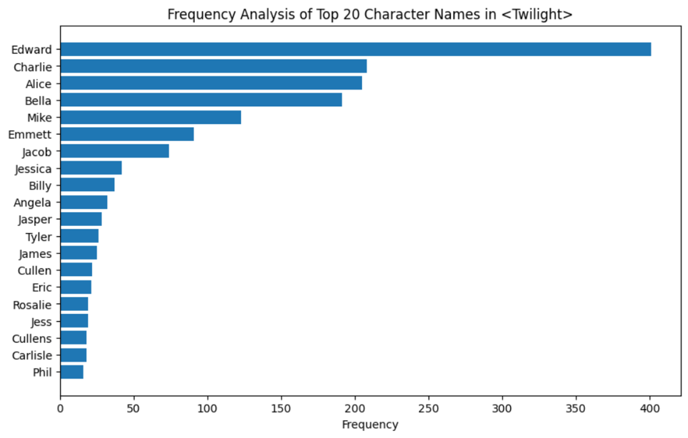
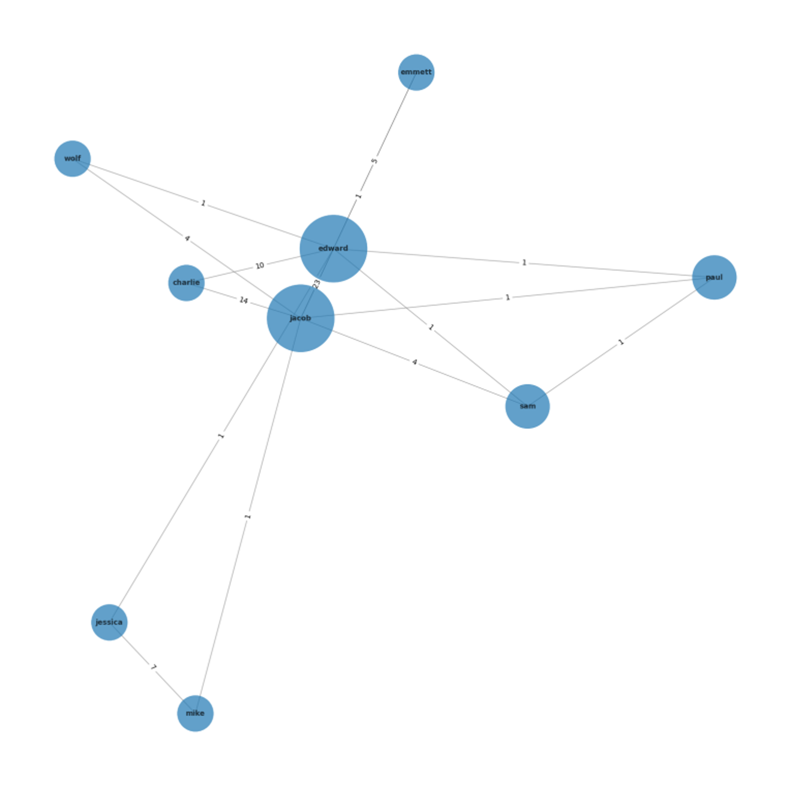
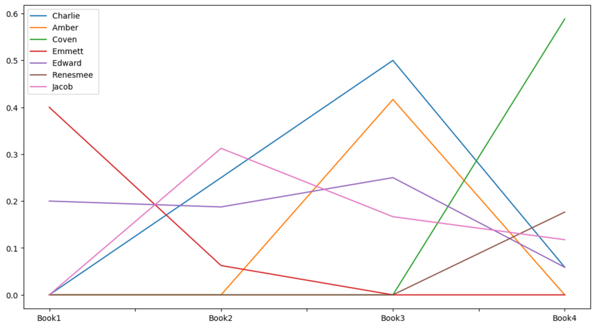
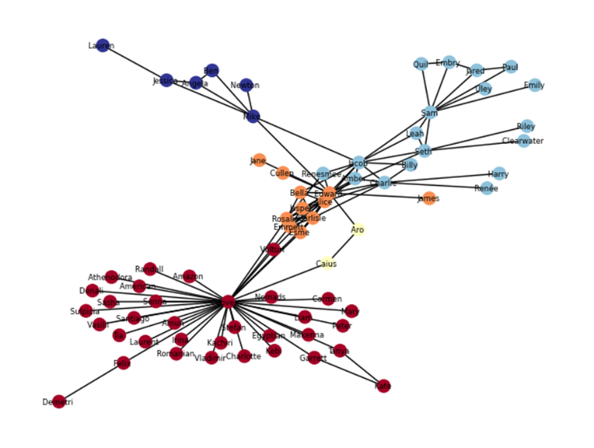
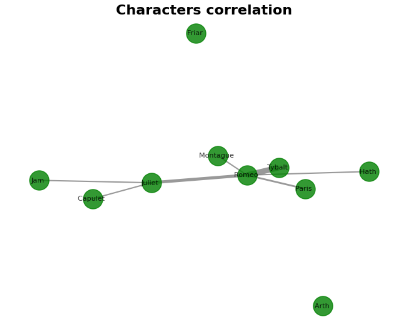

# Twilight-Network-Analysis

  

## Overview
This project was conducted for the purpose of analyzing the emotional network and importance between the characters of the novel 'Twilight'. As a dataset, we downloaded [4 books](https://blog.naver.com/PostView.naver?blogId=punch833&logNo=220808271039) in English of Twilight and analyzed them based on natural language processing and graph theory.

## Why Character Network? 
- Understanding the interactions and relationships between characters.

- Identifying the key central characters in the story.

- Grasping the structure of the narrative.

- Engaging the reader's emotional connection.

## Research Questions
- Can we identify the **main characters** based on the **frequency** of their mention throughout the overall text of the book?
  
    ☞ Analysis of character importance in the novel

- Can we understand the depth of relationships and **emotional connections** between characters based on how often two characters are mentioned within the same sentence?

    ☞ Analysis of character relationships in the novel

- Can we successfully **cluster** characters by applying a community detection algorithm to the relationship analysis results?
(Good and evil / Wizards and humans / Vampires and humans, etc.)

    ☞ Clustering analysis using Community Detection Algorithm

## Methodology

The analysis is performed through the following steps:

1. **Loading the Book Text**
   - `load_book`: Reads the full text of a book from a `.txt` file and returns it as a string. Optionally, the text can be converted to lowercase.

2. **Loading Character Names**
   - `load_characters`: Reads a `.csv` file containing a list of character names. Each character's different names, nicknames, or parts of their full name are separated by commas.

3. **Removing Punctuation**
   - `remove_punctuation`: Strips all punctuation from the input text to prepare it for further processing.

4. **Extracting Character Names**
   - `extract_character_names`: Utilizes the `spacy` library to identify proper nouns within the text and filters them against common stopwords to produce a list of plausible character names.

5. **Splitting Text into Sentences**
   - `get_sentence_sequences`: Divides the book into individual sentences using NLTK's sentence tokenizer.

6. **Splitting Text into Word Sequences**
   - `get_word_sequences`: Divides the book into segments based on a set number of words using NLTK's word tokenizer.

7. **Splitting Text into Character Sequences**
   - `get_character_sequences`: Breaks the book into substrings of a specified character length.

8. **Finding Character Connections**
   - `find_connections`: Counts instances of each character within each sequence of the text.

9. **Calculating Co-occurrence**
   - `calculate_cooccurence`: Computes the number of times two characters appear in the same sequences, forming the basis for a co-occurrence matrix.

10. **Generating Interaction Dataframe**
    - `get_interaction_df`: Transforms the co-occurrence matrix into a dataframe of character interactions, which can be used to construct a graph of character relationships.

11. **Running the Full Analysis**
    - `bookworm`: Orchestrates the full analysis pipeline, from loading the book and character data to producing the final interaction dataframe.

## Usage

To run this analysis, ensure you have the necessary text and character `.csv` files. (You can make in the jupyter code) 

Adjust the `threshold` parameter to filter the strength of character interactions as needed.

The resulting dataframe is compatible with network analysis libraries such as NetworkX, allowing for visual representation and further exploration of character relationships within the narrative.

## Dependencies

This project requires the following Python libraries:
- `nltk`
- `pandas`
- `numpy`
- `spacy`

Make sure to install these dependencies before running the analysis.

## Details

**1. method ①**
- Analyzing characters who are frequently mentioned throughout the book (e.g., Top 25 characters by mention frequency)
- Characters who are mentioned often could be important in the story
- There is a possibility that they may not be central characters in the overall narrative

  
  

  
  

**2. method ②**
- After extracting characters that are mentioned more than a certain threshold throughout the book, delete characters who do not belong to a major network
- It is possible to identify important characters in the overall story flow
- There is a possibility of deleting important characters

  
  

## Additional task
- **Community Detection**

As part of our analysis, we utilized the Louvain algorithm to cluster characters based on their interactions. The Louvain method is a widely-used community detection technique that allows us to discover the modular structure within the network of character interactions. Here's how we integrated the Louvain algorithm into our pipeline:

1. **Network Construction**
   - After obtaining the interaction dataframe from the `bookworm` analysis, we constructed a weighted graph where nodes represent characters, and edges correspond to the strength of their interactions.

2. **Applying the Louvain Algorithm**
   - We applied the Louvain algorithm to this graph to identify clusters or communities of characters. These clusters represent groups of characters that interact more frequently with each other than with those outside of their community.

3. **Interpreting the Results**
   - The resulting clusters were analyzed to gain insights into the narrative structure of the book. Clusters may represent various narrative elements such as alliances, familial relationships, or oppositions within the story.

4. **Visualization**
   - For a more intuitive understanding of the character clusters, we visualized the communities using network visualization tools. This helped illustrate the relationships and the relative importance of characters within the story.

  

- **Analyzing the well-known 'Romeo and Juliet'**

  

